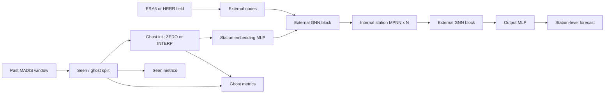

# Localized Weather Ghost-Node 모델 보고서

## 1. 요약

이 저장소는 지역 날씨 예측을 위한 이종 메시지 패싱 신경망(heterogeneous message passing neural network)을 구현한다. 모델은 station 위치에서의 기상 변수를 예측하며, 다음 세 가지 정보를 결합한다.

1. MADIS 기반의 과거 station 관측값
2. station 간의 공간적 관계
3. ERA5 또는 HRRR로부터 얻은 외부 대기장 정보

이 구조는 단순한 point-wise 예측기가 아니라, 공간적으로 정보를 전파하고 지역적 신호와 대규모 대기 신호를 함께 활용하는 그래프 기반 시공간 모델이다. 또한 ghost-node generalization이라는 독특한 평가 설정을 지원하는데, 이는 일부 station을 학습과 평가에서 직접 관측하지 않도록 가린 뒤 모델이 얼마나 잘 추론하는지 확인하는 방식이다.

핵심적으로 이 모델은 개별 지점의 값을 외우는 것이 아니라, 공간적 의존성과 외부장의 영향을 함께 학습해 결측 또는 비관측 위치까지 일반화하는 것을 목표로 한다.

---

## 2. 문제 정의

예측 대상은 다음과 같은 station 수준의 기상 변수들이다.

- wind u component
- wind v component
- 2 m temperature
- 2 m dewpoint

각 forecast step에서 모델은 다음 입력을 받는다.

- MADIS 관측의 시간 히스토리
- station 좌표
- ERA5 또는 HRRR에서 유도된 외부 격자장

이 모델의 목표는 주어진 lead time에서 각 station의 목표 변수를 예측하는 것이다.

이 문제는 일반적인 시계열 예측과 다르다. 모델은 시간 정보뿐 아니라 공간적 상호작용, 지리적 근접성, 그리고 외부 대기장의 영향까지 함께 학습해야 한다.

---

## 3. 입력 표현

### 3.1 Station history

각 station $i$에 대해, 코드에서는 과거 관측값의 시간 블록을 구성한다. station history를 $x_i^{\text{madis}}$라고 하면, station 위치도 함께 사용한다.

$$
 p_i = (\text{lon}_i, \text{lat}_i).
$$

이후 첫 번째 학습 표현은 embedding MLP를 통해 생성된다.

$$
 h_i^{(0)} = \phi_{\text{emb}}([x_i^{\text{madis}}, p_i]).
$$

구현 관점에서는 station history를 flatten한 뒤 좌표와 concatenation하여 MLP에 넣는다.

### 3.2 External field

외부 branch는 ERA5 또는 HRRR 노드를 사용한다. 이 노드들은 interpolation 방식이나 network construction 설정에 따라 station 위치에 직접 대응되거나, 근접 grid node들의 graph로 표현된다.

각 외부 node는 자신의 위치와 함께 인코딩된다.

$$
 z_k = \phi_{\text{ext}}([x_k^{\text{ext}}, p_k^{\text{ext}}]).
$$

station graph와 external graph는 k-nearest-neighbor 매핑을 통해 연결된다.

---

## 4. 네트워크 구조

핵심 모델 클래스는 [Source/Modules/GNN/MPNN.py](Source/Modules/GNN/MPNN.py)의 `MPNN`이다. 구조는 크게 세 단계로 구성된다.

1. station embedding
2. external message passing, internal station message passing, external message passing
3. output decoding

### 4.1 Station embedding

모델은 먼저 station history와 좌표를 hidden state로 인코딩한다. 이렇게 각 station은 그래프 전파 전에 학습된 latent representation을 갖게 된다.

### 4.2 External message passing

external block은 ERA5 또는 HRRR 정보를 station representation에 주입한다. 코드에서는 internal station pass 이전에 하나, 이후에 하나의 `GNN_Layer_External` 블록이 사용된다.

개념적으로는 다음과 같은 흐름이다.

- coarse atmospheric context에서 시작
- station-to-station link를 통해 정보 전파
- external field로 다시 refinement

즉 외부 대기장과 station 간 상호작용을 두 번 반영하는 구조다.

### 4.3 Internal message passing

internal graph는 station들끼리 연결한다. 메시지 함수는 source와 target node의 hidden state, meteorological state 차이, 공간적 위치 차이를 사용한다.

간단히 쓰면 다음과 같다.

$$
 m_{ij} = \psi_m([h_i, h_j, u_i-u_j, p_i-p_j]).
$$

업데이트는 residual 구조를 가진다.

$$
 h_i' = h_i + \psi_u([h_i, \sum_{j \in \mathcal{N}(i)} m_{ij}]).
$$

실제 구현에서는 propagation 이후 instance normalization이 적용된다.

### 4.4 Output layer

최종 propagation 이후, output MLP가 latent state를 목표 변수로 변환한다.

$$
 \hat{y}_i = f_{\text{out}}(h_i^{\text{final}}).
$$

이것은 classification이 아니라 multi-output regression head이다.

---

## 5. Ghost-node 일반화

ghost-node 학습은 별도의 모델 계열이 아니라, held-out station에 대한 일반화 성능을 검증하는 프로토콜이다.

### 5.1 Seen / ghost 분할

station은 한 번 split되어 다음 두 그룹으로 나뉜다.

- seen stations: 직접 loss에 사용되는 station
- ghost stations: 직접 loss에서 제외되는 station

이 split은 설정된 seed 하에서 결정적이다.

### 5.2 Ghost initialization

ghost station은 그래프 안에는 그대로 존재하지만, 과거 입력이 다르게 초기화된다.

코드는 두 가지 모드를 지원한다.

- ZERO: ghost station history를 0으로 채움
- INTERP: 가까운 seen station 정보를 이용해 초기화

즉, ZERO는 어떠한 prior 없이 missing history를 복원할 수 있는지를 검사하고, INTERP는 공간적 이웃으로부터 얻은 coarse prior가 있을 때 성능이 어떻게 변하는지 본다.

### 5.3 Sensor dropout

sensor dropout은 추가적인 training-time perturbation이다. seen station 일부를 무작위로 마스킹한 뒤 loss를 계산한다. 이를 통해 모델이 특정 sensor 하나에 지나치게 의존하지 않도록 하고, 관측이 불완전할 때의 강건성을 높인다.

### 5.4 Loss masking

training loss는 실제 관측값이 존재하는 seen subset에 대해서만 계산된다. ghost station은 직접적인 학습 타깃이 아니다.

이 구조는 다음을 명확히 분리한다.

- 관측된 station에 대한 최적화
- 가려진 station에 대한 일반화

---

## 6. 코드 상 데이터 흐름

주요 training 흐름은 [Source/Main.py](Source/Main.py)에 구현되어 있다.

### 6.1 Station graph 생성

MADIS graph는 [Source/Settings/Settings.py](Source/Settings/Settings.py)에서 정의된 network construction method를 사용해 station 좌표로부터 구성된다. 일반적으로 k-nearest-neighbor 방식이 사용되며, sparse하고 local한 graph를 만든다.

### 6.2 External graph 생성

외부 branch는 ERA5 또는 HRRR loader를 사용한다. interpolation mode에 따라 external input은 다음 중 하나로 구성된다.

- station 좌표로 직접 interpolation
- stacked neighborhood feature
- nearest-neighbor field

### 6.3 Batch 처리

모델은 station graph batch를 처리한다. 각 batch마다 graph structure를 만들고, MPNN을 실행하고, mask를 적용하고, loss를 계산한 뒤 Adam으로 parameter를 갱신한다.

---

## 7. 학습 목적 함수

학습 목적은 masked regression loss이다.

타깃이 존재하는 batch sample에 대해 모델은 다음을 최소화한다.

$$
 \mathcal{L} = \sum_{(i,t) \in \Omega} \ell(\hat{y}_{i,t}, y_{i,t}),
$$

여기서 $\Omega$는 valid seen observation의 집합이며, $\ell$은 선택된 loss function이다.

저장소는 MSE, MAE, custom weighted meteorological loss 등 여러 loss type을 지원한다. 특히 wind component를 다른 변수와 함께 다룰 때 custom metric이 유용하다.

---

## 8. 평가 방식

평가 코드는 여러 수준의 성능을 보고한다.

- 전체 valid node에 대한 global score
- seen-station score
- ghost-station score
- 변수별 MSE / MAE

이 구분이 중요한 이유는 하나의 종합 점수만으로는 observed station과 hidden station 사이의 큰 차이를 놓칠 수 있기 때문이다.

가장 의미 있는 해석은 보통 다음 두 가지를 함께 보는 것이다.

- seen performance: known station에 얼마나 잘 맞추는가
- ghost performance: unseen station에 얼마나 잘 일반화하는가

ghost performance가 좋아지는 동시에 seen performance가 유지된다면, 모델이 단순히 overfit된 것이 아니라 공간적으로 더 강건해졌다고 볼 수 있다.

---

## 9. 날씨 문제에 이 구조가 적합한 이유

날씨장은 독립적인 점값이 아니다. 공간적으로 부드럽게 변하지만 항상 선형적인 것은 아니며, local station structure와 large-scale atmospheric forcing의 영향을 동시에 받는다.

이 모델은 다음 세 가지 이유로 이러한 구조와 잘 맞는다.

1. grid-only convolution이 아니라 graph를 사용한다.
2. station-to-station 상호작용을 명시적으로 학습한다.
3. 과거 station 값만이 아니라 external weather field를 조건으로 사용한다.

결과적으로 이 모델은 local downscaler처럼 동작할 수 있다.

---

## 10. Ghost-node Figure

이 figure는 코드베이스의 실제 흐름을 반영한다.

- station history를 먼저 embedding
- external context를 graph block으로 주입
- station 간 정보를 internal propagation으로 전달
- external branch로 다시 refinement
- 최종 출력을 station별로 생성
- seen / ghost metric을 분리해서 추적

---

## 11. Ghost 실험의 실용적 해석

ghost 실험은 센서가 일부 누락되거나 off-grid target point가 존재하는 배치에서 특히 의미가 크다.

최종 응용에서 target location에 dense observation이 이미 있다면, ghost tuning은 주로 robustness study에 가깝다. 여전히 중요하지만, primary operational forecast를 직접 개선하는 것과는 다르다.

반대로 최종 응용이 genuinely off-grid이거나 sparsely observed라면, ghost-node 성능은 보조 지표가 아니라 핵심 지표다.

이 경우 가장 의미 있는 비교는 전체 validation loss가 아니라, 동일 split과 동일 training protocol에서 seen과 ghost performance의 차이다.

---

## 12. 중요한 설정값

모델의 동작은 다음 설정에 크게 영향을 받는다.

- `ghost_holdout_ratio`: 몇 개의 station을 ghost로 가릴지 결정
- `ghost_init_mode`: ghost를 zero로 시작할지 interpolation으로 시작할지 결정
- `ghost_split_seed`: split 재현성
- `sensor_dropout`: 학습 중 seen sensor를 마스킹할지 여부
- `sensor_dropout_ratio`: dropout 강도
- `interpolation_type`: external field를 station에 어떻게 연결할지
- `n_neighbors_e2m`: 각 station에 연결되는 external node 수
- `n_neighbors_m2m`: station graph의 밀도

특히 ghost initialization과 interpolation mode가 가장 큰 영향을 주는 경우가 많다. 이 두 설정이 hidden station에 대한 prior information의 양을 직접 결정하기 때문이다.

---

## 13. 실험 결과를 정리하는 방법

깔끔한 보고를 위해 각 실험은 다음 항목으로 요약하는 것이 좋다.

1. training loss
2. validation loss
3. seen-station score
4. ghost-station score
5. 변수별 MAE와 MSE
6. interpolation mode와 dropout 설정

이 정도의 compact table이면 어떤 설정이 일반화에 실제로 유리한지 설명하기에 충분하다.

---

## 14. 저장소 코드와의 대응 관계

가장 중요한 source file은 다음과 같다.

- [Source/Main.py](Source/Main.py)
- [Source/EvaluateModel.py](Source/EvaluateModel.py)
- [Source/Dataloader/MixData.py](Source/Dataloader/MixData.py)
- [Source/Modules/GNN/MPNN.py](Source/Modules/GNN/MPNN.py)
- [Source/Modules/GNN/GNN_Layer_Internal.py](Source/Modules/GNN/GNN_Layer_Internal.py)
- [Source/Modules/GNN/GNN_Layer_External.py](Source/Modules/GNN/GNN_Layer_External.py)
- [Source/Network/MadisNetwork.py](Source/Network/MadisNetwork.py)
- [Source/Network/ERA5Network.py](Source/Network/ERA5Network.py)
- [Source/Dataloader/ERA5Interpolated.py](Source/Dataloader/ERA5Interpolated.py)

이 파일들이 함께 training, evaluation, data loading 전 과정을 구성한다.

---

## 15. 결론

이 저장소는 station history, station 간 공간 관계, external atmospheric context를 하나의 forecasting pipeline으로 결합한 시공간 graph neural network를 구현한다.

ghost-node 확장은 robustness와 spatial generalization을 평가하는 유용한 축을 추가한다. 특히 deployment target이 직접 관측되지 않는 경우 중요성이 커진다.

모델링 관점에서 보면, 이 구조는 주변 station과 더 넓은 대기장으로부터 local condition을 추론하는 weather downscaler로 이해하는 것이 가장 적절하다.
